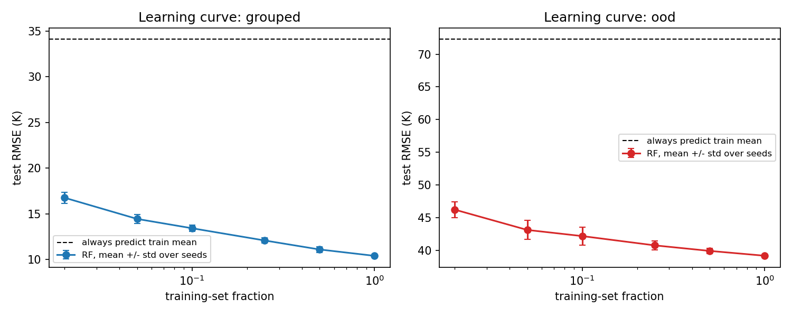
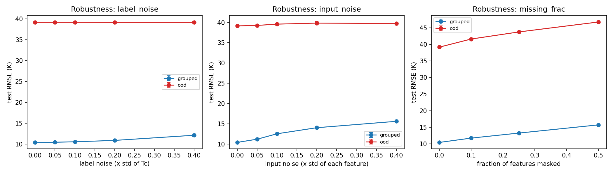

# What drives generalization? A controlled stress test of a fixed Random Forest

One public scientific dataset, one fixed model, and a sweep over how the **data** is changed: training-set size, label noise, input noise, missing features, and an out-of-distribution split. The model is never tuned or swapped, so differences between conditions come from the data.

**Headline result:** with the model held fixed, test RMSE was 9.4 K on the random split, 10.4 K on the grouped split and 39.2 K on the out-of-distribution (OOD) split. In this setup, the choice of test set was associated with larger changes in error than any of the training-data perturbations tested.

---

## Purpose

Model results are usually reported on a single random split, which hides how much of the outcome depends on the data and on how the test set is chosen. This project asks a narrower question: **with the model fixed, which properties of the data are associated with how well it generalizes?**

- It is a validation experiment, not a model-building exercise. No leaderboard chasing, no hyperparameter tuning, no second model.
- Every condition is repeated over 10 seeds, so differences can be compared against run-to-run spread.
- The design (splits, perturbation levels, seeds, model settings, metric) was written to `config.yaml` and committed in `a085154` on 2026-09-30 (18:10 IST) and has not been changed since. A one-run baseline check before that commit informed the choice of `grouped` as the primary split. 2-seed smoke runs after it (the same evening) tested the pipeline and led to dropping duplicate conditions in `src/sweep.py`; levels, seeds and model settings did not change. A first full-sweep launch on 2026-10-01 was stopped after about 110 runs and its output deleted, so that every row records the commit of the code that produced it; the first 34 rows of the rerun (first row 10:01:44) matched it. No hypotheses or pass/fail thresholds were written down before the run. Full timeline: `PROTOCOL.md`.
- Analyses done after seeing results are labeled *post-hoc*.

---

## Benchmark setup

| Item | Choice |
| --- | --- |
| Dataset | UCI *Superconductivty Data* (the repository spells it this way): 21,263 materials, 81 numeric features derived from the chemical formula, target `critical_temp` (Tc, K). Files and SHA-256 hashes are in `config.yaml`; downloaded 2026-09-30. |
| Model | `RandomForestRegressor`, 200 trees, fixed settings from `config.yaml`, `random_state` = seed. No tuning, no feature engineering, no dimensionality reduction. |
| Primary metric | RMSE in K. MAE and R² are also recorded. R² is not used for the OOD split because its test range is narrow. |
| Reference | "Always predict the training mean": 34.1 K (grouped), 72.4 K (OOD). |
| Seeds | 10 per condition (0 to 9). Seeds change the model, the noise draws and the subsampling. The train/test partition is fixed. |
| Total runs | 430 (43 conditions x 10 seeds) |

**Test sets**

| Split | Definition | Train / test rows |
| --- | --- | --- |
| `grouped` (primary) | 20% of formulas held out; all rows of a formula stay on one side | 17,098 / 4,165 |
| `ood` | Train on Tc <= 74.0 K, test on Tc > 74.0 K. The boundary is the 80th percentile of Tc over the full dataset; it defines the split, and the model never sees test labels. | 17,014 / 4,249 |
| `random_iid` (baseline only) | Random 20% of rows | 17,010 / 4,253 |

`grouped` is the primary split because 37.5% of rows belong to a formula that appears more than once (15,542 distinct formulas in 21,263 rows). Rows of the same formula have identical features, so in a random split a test row can have an identical twin in the training set, which can make the random-split score optimistic.

**Perturbations** (one factor at a time, plus a size x label-noise grid)

| Factor | Levels | How it is applied |
| --- | --- | --- |
| Training-set size | 2, 5, 10, 25, 50, 100% | Random subsample of the training rows |
| Label noise | 0, 0.05, 0.1, 0.2, 0.4 | Gaussian, std = level x std of the training Tc. Training labels only |
| Input noise | 0, 0.05, 0.1, 0.2, 0.4 | Gaussian, std = level x the standard deviation of each feature (training-set std, raw units; equivalent to std = level on standardized features). Training features only |
| Missing features | 0, 10, 25, 50% of cells | Random cells masked in train **and** test, filled with training means |
| Interaction grid | size {10, 50, 100%} x label noise {0, 0.2, 0.4} | Assembled from 4 rows labeled `interaction` in `raw.csv` plus 5 cells that coincide with the baseline, size-only or label-noise-only runs. Identical fits are not repeated; `src/analyze.py` selects rows by the four setting columns. |

---

## Key findings

All numbers are test RMSE in K, mean +/- std over 10 seeds (full table: `results/summary.csv`).

| Condition | Grouped | OOD |
| --- | --- | --- |
| Baseline (full data, no perturbation) | 10.42 +/- 0.05 | 39.17 +/- 0.09 |
| Training size 50% | 11.11 +/- 0.31 | 39.90 +/- 0.39 |
| Training size 10% | 13.43 +/- 0.32 | 42.17 +/- 1.37 |
| Training size 2% | 16.77 +/- 0.60 | 46.22 +/- 1.19 |
| Label noise 0.4 | 12.11 +/- 0.34 | 39.15 +/- 0.23 |
| Input noise 0.4 | 15.61 +/- 0.12 | 39.75 +/- 0.36 |
| 10% features masked | 11.72 +/- 0.14 | 41.61 +/- 0.09 |
| 50% features masked | 15.71 +/- 0.17 | 46.75 +/- 0.17 |

Random-split baseline: 9.43 +/- 0.01.

1. **Test-set composition is associated with the largest differences.** The same model scores 9.4 K, 10.4 K and 39.2 K on the random, grouped and OOD splits. About 90% of the OOD squared error is systematic under-prediction of hot materials (seed 0: bias -28 K for Tc 74 to 100 K, -64 K above 100 K), not scatter.
2. **Grouped split: less data, missing features and input noise were each associated with increases of 5.2 to 6.4 K at the most-damaged level tried (input noise 0.4, 50% masked, 2% data).** Label noise added 1.7 K at 0.4, and at most 0.13 K up to 0.1 (comparable to seed spread). The learning curve has not saturated (16.8 K at 2% of the data, 10.4 K at 100%). The levels are not commensurable across factors, so this ranks the tested levels only.
3. **OOD split: label and input noise changed RMSE by at most 0.7 K.** Missing features (+7.6 K at 50%) and tiny training sets (+7.1 K at 2%) did more. Going from 50% to 100% of the data gained only 0.7 K.
4. *(post-hoc)* **The data sets an error floor on repeated formulas.** Repeated formulas have identical features but different Tc: pooled within-formula std is 6.85 K, and `Y1Ba2Cu3O7` has 110 rows spanning 30 to 130 K. A model that sees only formula-derived features must give all of them one prediction.
5. *(post-hoc)* **Chemistry family matters and is confounded with Tc.** Copper-oxide compounds have 13.6 K RMSE against 5.6 K for the rest (grouped), and are already at 12.7 K for Tc <= 74 K. 841 of the 842 grouped test rows above 74 K are cuprates. Hot cuprates have 14.9 K RMSE when other hot cuprates are in training and 39.0 K when none are (OOD). This suggests the OOD failure mostly reflects missing exposure to the hot range, although the two test sets are different rows.
6. *(post-hoc)* **The choice of test partition moved the headline more than the model's randomness did.** On the committed partitions the random split scores 9.43 K and the grouped split 10.42 K (gap 0.98 K). Across ten grouped partitions (split seeds 0 to 9; seed 0 is the committed one; model seed fixed at 0), baseline RMSE ranges from 9.00 to 10.47 K (mean 9.68, std 0.42), and the committed partition is the highest of the ten and the committed gap probably overstates the typical one; the random split's own partition spread was not measured. The std across seeds on one partition is 0.05. One formula (`Tl2Ba2Cu1O6`, 45 rows) accounts for 16.7% of the committed partition's squared error (RMSE 9.61 K without it). Comparisons between conditions use the same test set, but absolute levels depend on the partition.

Figures: `figures/learning_curves.png`, `robustness_curves.png`, `baseline_comparison.png`, `interaction_size_x_labelnoise.png`, `pred_vs_true.png`.




Full discussion and failure cases: [`memo.md`](memo.md).

---

## Project flow

```
data/train.csv (81 features + Tc)         config.yaml  (design, committed before the sweep)
data/unique_m.csv (formula, elements)            |
        |                                        |
        +------------------+---------------------+
                           v
                   src/data.py        load data, build the 3 splits
                           v
                   src/perturb.py     subsample / label noise / input noise / masking
                           v
                   src/sweep.py       fit the fixed Random Forest for every
                           |          condition x split x seed (430 runs)
                           v
              results/raw.csv + results/preds/
                           v
                   src/analyze.py     curves, seed uncertainty, failure cases
                           v
        figures/   results/summary.csv   failure_cases/
                           v
                        memo.md

post-hoc, outside the committed design:
   src/audit.py, src/audit_errors.py  ->  results/audit.txt, results/audit_errors.txt

run.py = sweep + analyze in one command.  exception/ and logger/ are used by every script.
```

---

## Repository layout and purpose of each file

| Path | Purpose |
| --- | --- |
| `config.yaml` | The experiment design: dataset files and hashes, splits, perturbation levels, seeds, model settings, metric. Committed in `a085154` before the sweep; not edited afterwards. |
| `run.py` | One-command runner: sweep, then analysis. |
| `src/data.py` | Loads the data and builds the `grouped`, `ood` and `random_iid` splits. Running `python -m src.data` prints split sizes and checks that no formula appears on both sides of the grouped split. |
| `src/perturb.py` | The four data perturbations. Each takes a seed and is reproducible. Running it as a module self-tests the noise sizes and masking share. |
| `src/sweep.py` | Loops over conditions, splits and seeds, fits the model, and appends one row per run to `results/raw.csv`. Resumes if interrupted. |
| `src/analyze.py` | Turns `raw.csv` and the saved predictions into figures, `summary.csv`, and the failure-case tables. |
| `src/audit.py` | *Post-hoc.* Repeated formulas and their Tc spread, which formulas cause repeated predictions, composition of the OOD test set. |
| `src/audit_errors.py` | *Post-hoc.* Which formulas carry the squared error, cuprates vs the rest, and sensitivity of the baseline to the test partition (10 refits). |
| `exception/exception.py` | `CustomException`: reports file name, line number and message of a failure. |
| `logger/logger.py` | Shared logger: writes to the terminal and to a timestamped file in `logs/`. |
| `data/` | `train.csv` and `unique_m.csv` from the UCI repository (committed so the repo runs without a download). |
| `results/raw.csv` | One row per run: condition, split, seed, `n_train`, RMSE, MAE, R², reference RMSE, code commit (`git_hash`), timestamp. |
| `results/summary.csv` | Mean and std over seeds for every condition. |
| `results/preds/` | Seed-0 test predictions for the baseline and the most-damaged condition of each factor. Input to the failure analysis. |
| `results/audit.txt`, `audit_errors.txt` | Output of the two audit scripts. |
| `figures/` | Learning curves, robustness curves, baseline comparison, interaction heatmap, predicted vs true. |
| `failure_cases/` | `worst_cases.csv` (largest errors with feature values), `error_by_tc_bin.csv` (bias and RMSE per Tc range), `feature_shift.csv` (features that differ most for the worst 5% of predictions). |
| `memo.md` | Short write-up: findings, failure cases, limits. |
| `PROTOCOL.md` | Design, controls, metrics, stopping rule, and a dated timeline of what was decided when. |
| `FREEZE.json` | Freeze manifest: design and code commit SHAs, dataset hashes, model and library versions (written by `src/make_freeze.py`). |
| `CLAIMS.md` | Each conclusion mapped to the artifact that supports it; unsupported claims listed separately. |
| `REPRODUCE.md` | Shortest path to reproduce the results. |
| `CLOSEOUT.md` | Status (mixed) and reason. |
| `src/claims_check.py` | Recomputes the derived numbers quoted in the README and memo into `results/claims_numbers.csv`. |
| `src/make_freeze.py` | Writes `FREEZE.json`. |
| `requirements.txt` | Python dependencies. |
| `logs/` | Created at run time, not committed. |

---

## Run it

```
pip install -r requirements.txt
python run.py            # sweep (resumes; skips runs already in results/raw.csv), then figures and tables
python run.py --quick    # smoke test: 2 seeds, end levels only, writes to results/quick (about 5 min)
python run.py --fresh    # delete results/raw.csv and results/preds, recompute everything (about 80 min on a laptop CPU)
python run.py --analyze-only
```

Post-hoc audits (not part of `run.py`):

```
python -m src.audit > results/audit.txt
python -m src.audit_errors > results/audit_errors.txt
```

**Reproducibility notes**

- `results/raw.csv` is committed, so a plain `python run.py` finds all 430 runs done and only regenerates figures. Use `--fresh` to recompute.
- A fresh recompute with the same library versions should reproduce `rmse`, `mae` and `r2` exactly (same seeds); `timestamp` and `git_hash` will differ. A `--quick` rerun on a later day reproduced the committed values to four decimals.
- The `git_hash` in `results/raw.csv` is `979d3f8`, the commit containing the sweep code that produced it.
- Tested with Python 3.13.9.

---

## Limitations

- **One dataset, one model.** A random forest predicts averages of training labels, so it cannot predict above the highest training Tc. Whether another model would do better was not tested (by design).
- **Fixed partition.** Error bars cover model, noise and subsampling randomness, not the choice of test partition (finding 6).
- **Perturbation levels are not commensurable across factors.** Input noise is applied to training data only, masking to train and test, and label noise is not clipped (training labels can go below 0).
- **Failure-case tables and findings 4 to 6 are post-hoc**, and the failure cases come from single runs (seed 0).
- **Tc and chemistry are confounded** in this dataset: almost every hot material is a copper-oxide compound.
- Conclusions are specific to this dataset, this feature representation, this Random Forest baseline, these split definitions and these perturbation levels.

---

## Data source

Hamidieh, K. (2018). *A data-driven statistical model for predicting the critical temperature of a superconductor.* Computational Materials Science, 154, 346 to 354. Dataset: UCI Machine Learning Repository, "Superconductivty Data". See the dataset page for license terms.
